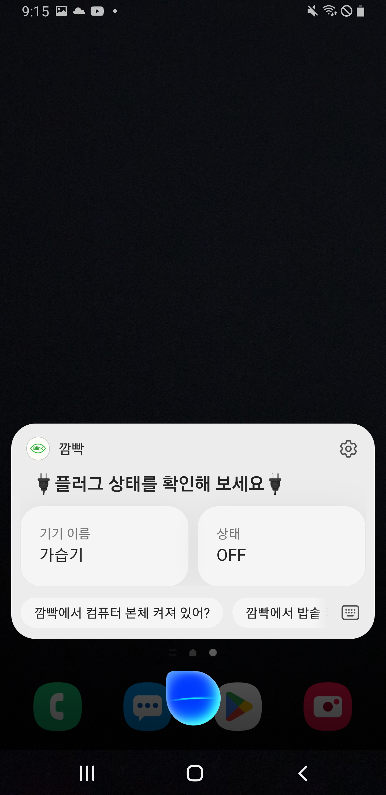

# [전국대학 소프트웨어 성과 공유포럼] IoT기반, 1인 가구 에너지 절감 시스템

 

> ### [📁 프로젝트 논문 보기](https://drive.google.com/file/d/1zogCa5vQ674gPMHO9FeUQh_ujM1negOy/view?usp=sharing) 

> ### [▶️ 유튜브 시연 영상 보기](https://youtu.be/YDuMfFvXSk8?si=PmmphLaOkcZsSjkL) 

> ### [📌 유튜브 발표 영상 보기](https://youtu.be/QBwjEyp4fYg?si=5EQ07dm0B6eDjGqm) 

 

## 🌟 프로젝트 요약

- 본 프로젝트는 **제2회 전국대학 소프트웨어 성과 공유포럼** 에서 **최우수상 / 총장상을 수상**하였습니다.

- 지속되는 **전기료 증가와 스마트홈 시장 규모의 확장**으로 인해, IoT로 방향성을 잡게 
되었습니다.

- 설문 과정을 통해 **사용의 번거로움과 서비스 안정성 및 개인 정보 보호**를 목표로 선정했습니다.

- 문제 해결을 위해, **직관적인 앱 UI/UX 및 빅스비*를 통한 음성 제어**를 설계했습니다.

- 또한 **AI가 개인 에너지 데이터로 학습해, 개인 맞춤형 에너지 절감 조언**을 
진행합니다.

- 최종적으로 **실제 전기요금 14%** 를 감소 시킬 수 있었습니다.

### 전체 시스템 아키텍처

**시스템 아키텍처**

**기능 아키텍처**

 

## 목차

1. [개발 환경](#1-%EF%B8%8F-개발-환경)

2. [사용 기술 스택](#2-사용-기술-스택)

3. [프로젝트 구조](#3-%EF%B8%8F-프로젝트-구조)

4. [개발 기간 및 작업 관리](#4-개발-기간-및-작업-관리)

5. [개발 중점 사항](#5-개발-중점-사항)

6. [역할 분담](#6-%EF%B8%8F역할-분담)

7. [기능 시연](#7-%EF%B8%8F기능-시연)

8. [추후 고려 사항](#8--추후-고려-사항)

9. [프로젝트 회고](#9--프로젝트-회고)

 

## 1. 🛠️ 개발 환경

- IDE: IntelliJ IDEA Community Edition 2024.1.4

- 개발 언어: Java 21 (Spring 3.4.2)

- 서버 : AWS(Amazon Web Service) EC2 (CPU : t2.micro, RAM : 1GB, HDD : 30GB)

- OS : Ubuntu 24.04.2 LTS

- 데이터베이스: MySQL 8.0.42, MongoDB 6.0.20, Redis 7.0.15

- 접속 및 키 관리 : Putty

- 버전 관리 : [GitHub - IoT기반, 1인 가구 에너지 절감 시스템](https://github.com/junyoung011019/aiot_smart_home_spring), GitHub Desktop
- 협업 도구: Discord, Google Drive

 

## 2. 🔌 사용 기술 스택

### AWS 관리

- VPC를 통한 서비스 구축

  - H사의 서버와 중간 다리 역할로 멀티 클라이언트(플러터 앱과 빅스비)에 대응할 수 있도록 구축하였습니다.

  - 특히 많은 요청에 대응할 수 있도록 ALB와 EC2에는 Auto Scaling을 적용하여, 많은 요청에도 대응할 수 있도록 설계 하였습니다.

  - 특히 DB에 사용되는 RDS와 DocumentDB는 별도의 Private Subnet에 구축하여, 보안에 더욱 더 안전하도록 설계하였습니다.

- 클라우드 요금 최적화 전략

  - AWS RDS에 DB를 구축하여, 프리 티어 내에서 서비스를 운영하며 비용을 최소화하였습니다.

  - 탄력적 IP(Elastic IP) 대신 DNS를 활용하여 인스턴스 재시작 시에도 A 레코드를 업데이트하는 방식으로 IP를 관리함으로써, 팀원간 업무 동시 작업에 효율성을 더했습니다.

 

### Spring

- MVC(Model-View-Controller) 아키텍처 기반 시스템 설계

  - 클라이언트의 요청은 Controller, 비즈니스 로직은 Service, 데이터베이스 연동은 Repository, 데이터 객체는 Entity로 분리하여, 각 레이어의 책임을 명확히 나누는 구조로 설계하였습니다.
  
  - 특히, 객체 지향적인 Entity 설계와 Repository 기반의 데이터 접근을 통해, 데이터 처리의 안정성과 개발 생산성을 함께 향상시켰습니다.

- 다기종 플랫폼에 대한 API 설계  

  - 기존의 웹/모바일 환경뿐만 아니라, **빅스비(Bixby)** 와 같은 특수 음성 기반 클라이언트를 도입하여 다양한 플랫폼에서도 활용 가능한 API를 설계하였습니다.

  - **RESTful API 명세서**를 작성하고 공유함으로써, 클라이언트 개발자와의 원활한 협업을 이끌어냈으며, 명확한 인터페이스 정의로 개발 효율성과 일관성을 높였습니다.

- 다양한 스프링 어노테이션 활용

  - @Scheduled 어노테이션을 활용하여 매 정시 30분마다 불필요한 전력 사용을 탐지하는 기능이 자동으로 실행되도록 구성하였습니다.

  - @Value 어노테이션을 통해 외부 API 호출에 필요한 인증 키와 같은 민감한 정보를 설정 파일에서 분리하여 관리함으로써, 보안성과 유지보수성을 높였습니다.

 

### 다중 DB 설계

- 데이터 특성에 맞는 DB 선택

  - 회원 정보나 플러그 정보와 같은 정형 데이터는 관계형 데이터베이스인 MySQL에 저장했습니다.
  
  - 사용자 전력 사용 데이터와 같은 비정형 데이터는 MongoDB를 활용하여 효며, 단순히 기능 구현에만 그치지 않고,
각 기능이 어떤 흐름과 구조로 동작하는지를 파악하며 개발을 진행하였습니다.

- 주제 선정부터 각 단계별 산출물 작성을 중요하게 인식하고, 기획, 설계, 구현 등 모든 과정에 걸쳐 산출물을 적극적으로 생성 · 관리하였습니다.

- 주기적인 팀 회의를 통해 개발 일정을 조율하고, 문제 발생 시 함께 논의하여 해결함으로써 원활한 협업을 이어갔습니다.

### ✨ 핵심 성과
- 멀티 클라이언트 API 설계: Spring Boot를 사용하여 모바일 앱(Flutter)과 음성 AI(Bixby)의 동시 요청을 처리하는 RESTful API를 설계하고 구현했습니다.

- 성능 병목 현상 해결: OpenAI API 호출로 인한 대시보드 응답 지연 문제를 Redis 캐싱을 도입하여 평균 응답 시간을 효과적으로 단축시켰습니다.

- 다중 DB 설계: 정형 데이터(MySQL)와 비정형 시계열 데이터(MongoDB)의 특성에 맞게 DB 스키마를 분리하여 효율적인 데이터 처리를 구현했습니다.

 

## 6. 👥 역할 분담

- 정준영 (팀장)
  
  - 클라우드 서버(AWS) 설계 및 구축
  
  - DB 관리 및 운영
  
  - 멀티 클라이언트(빅스비 캡슐, 플러터 앱) 기반 스프링 부트 개발
  
  - 전체 시스템 설계 및 주제 선정
  
  - 팀 리더로서 팀원간 업무 분배 및 일정 관리

- [김성철 (빅스비 캡슐)](https://github.com/SungChul23/Bixby)

  - 빅스비 캡슐 중점 개발 및 배포

  - SageMaker 기반 요금 분석 모델 구축
  
  - 산출물 정리 및 관리
  
  - 정기적인 회의록 작성

- [안준섭 (플러터)](https://github.com/Anjunno/aiot_smart_home_flutter)

  - 앱 디자인 설계

  - 플러터 앱 개발 및 배포
  
  - 개발 흐름 리드

- 함동균 (AI)

  - DB 설계

  - 데이터 수집 및 정제, 가공

  - 조언 AI 설계

 

## 7. ▶️ 기능 시연

  ### 회원 기능 (일반, 카카오)

<table>
  <tr>
    <td align="center">
       
      로그인
    </td>
    <td align="center">
       
      회원가입
    </td>
  </tr>
</table>

      ⭐ 기능 설명
       - OAuth 2.0 기반 카카오 로그인 도입
       - 안전하고, 편리한 인증 시스템 구축

  ### 메인 화면

<table>
  <tr>
    <td align="center">
       
      메인화면
    </td>
  </tr>
</table>

      ⭐ 기능 설명
       - 한전 API를 통한 실시간 전기 요금 확인
       - 파이 차트를 통한, 이번달 기기 사용 분표 확인

  ### 기기 (그룹) 제어

<table>
  <tr>
    <td align="center">
       
      기기제어
    </td>
    <td align="center">
       
      그룹제어
    </td>
  </tr>
</table>

      ⭐ 기능 설명
       - 실시간 원격 제어
       - (그룹 기능) 필요한 기기끼리 묶어서 한번에 제어

  ### 사용량 조회

<table>
  <tr>
    <td align="center">
       
      사용량 그래프
    </td>
  </tr>
</table>

      ⭐ 기능 설명
       - 기기별 / 일별 / 월별 전력 사용량 추이 비교
       - 한줄 조언을 통해, 개인 맞춤형 조언 제공

  ### AI 조언

<table>
  <tr>
    <td align="center">
       
      대시보드
    </td>
    <td align="center">
       
      푸시 알림
    </td>
  </tr>
</table>

      ⭐ 기능 설명
      - 대시보드
       1일전 VS 2일전 사용 비교 / 기기별 세부 조언
      
      - 푸시 알림
       정시 30분마다, 실시간 작동 기기 판단 후 조언 전달

### 빅스비 로그인

<table>
  <tr>
    <td align="center">
       
      bixby 로그인
    </td>
  </tr>
</table>

      ⭐ 기능 설명
       - OAuth 2.0 기반 카카오 로그인 도입
       - 안전하고, 편리한 인증 시스템 구축

### 빅스비 기기(그룹) 조회

<table>
  <tr>
    <td align="center">
       
      기기 상태 조회
    </td>
    <td align="center">
       
      그룹조회
    </td>
  </tr>
</table>

      ⭐ 기능 설명
      - 기기 상태 조회
      - 앱에 등록된 그룹 조회

### 빅스비 기기(그룹) 제어

<table>
  <tr>
    <td align="center">
       
      기기제어
    </td>
    <td align="center">
       
      그룹제어
    </td>
  </tr>
</table>

      ⭐ 기능 설명
      - 기기 제어
      - 그룹 실행

 

## 8. 📌 추후 고려 사항

- <strong> 빅데이터 형성 </strong>
    
  장기간 전력 데이터를 수집해서, OpenAI가 아닌 실제 AI 학습 및 활용

- <strong> 대규모 트래픽 처리 </strong>

  실제 서비스의 규모(여러 사용자, 개인 맞춤형 AI 학습)를 고려해서 Load Balacner 등을 활용한 트래픽 분산 및 처리

- <strong> 대기 전력 차단 가능한 플러그 활용 </strong>

  상위 모델인 대기 전력 차단 플러그를 활용해, 대기 전력 차단

- <strong> 공식 앱 출시 </strong>
    
  플레이스토어에 공식 앱 출시해 정식 활용

 

## 9. 🤔 프로젝트 회고

- 백엔드 개발부터, 

  멀티 클라이언트(앱과 빅스비)의 요청에 대한 Restful API 설계를 해본 경험이라 뜻 깊었다.

  Spring은 Node.js와 다르게 프레임워크 자체로 구조적으로 설계가 되어있어 처음에 이해하는 부분은 어려웠지만, 조금 익숙해지니 편리하다고 느꼈다.

  
- AWS 클라우드 배포까지

    AWS라는 플랫폼을 써보면서 클라우드를 활용하며, 내가 지속적으로 해내오는 길과 진로에 대해 깊은 생각을 하게 되었다.

    클라우드 대부분의 구조는 비슷하므로, 하나를 집중적으로 공부해야해서 SAA 자격증도 시도해봐야겠다.

- 하나의 서비스 구현

  사용자 요구사항 분석부터 설계 및 구현까지 모든 개발 과정을 진행할 수 있어서 좋았다.

  또한 공공 데이터 포털이 아닌, 외부 API를 활용한 경험이라 더 의미 있었다.
  

