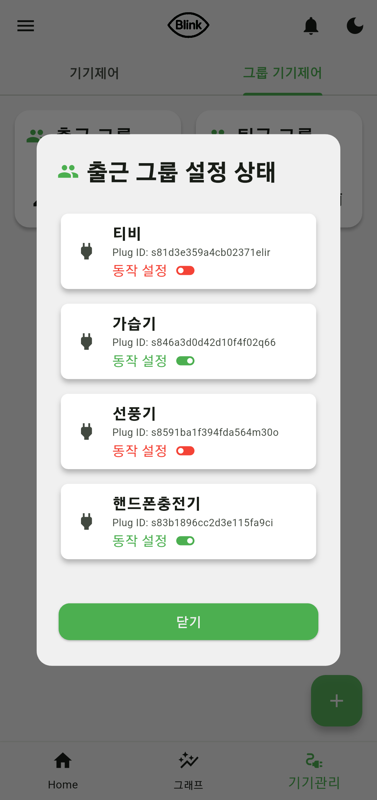

# [졸업작품] IoT기반, 1인 가구 에너지 절감 시스템 - Spring

<br>

> ### [📁 프로젝트 논문 보기](https://drive.google.com/file/d/1zogCa5vQ674gPMHO9FeUQh_ujM1negOy/view?usp=sharing) 


> ### [📌 유튜브 시연 영상 보기](https://youtu.be/dMZLcfVnr4k) 

<br>

## 🌟 프로젝트 소개

- 본 프로젝트는 캡스톤디자인(졸업작품, 논문)과 연계되어 진행되었습니다.

- 지속되는 전기료 증가와 스마트홈 시장 규모의 확장으로 인해, IoT로 방향성을 잡게 
되었습니다.
- 설문 과정을 통해 사용의 번거로움과 개인 정보 보호를 목표로 선정했습니다.

- 문제 해결을 위해, 직관적인 앱 UI/UX 및 빅스비를 통한 음성 제어를 설계했습니다.

- 또한 AI가 개인 에너지 데이터로 학습해, 개인 맞춤형 에너지 절감 조언을 
진행합니다.

- 최종적으로 실제 전기요금 14%를 감소 시킬 수 있었습니다.


> ### [📁 프로젝트 기획 단계 보기]() 

### 전체 시스템 아키텍처


<br>

## 목차

1. [개발 환경](#1-%EF%B8%8F-개발-환경)

2. [사용 기술 스택](#2-사용-기술-스택)

3. [프로젝트 구조](#3-%EF%B8%8F-프로젝트-구조)

4. [개발 기간 및 작업 관리](#4-개발-기간-및-작업-관리)

5. [개발 중점 사항](#5-개발-중점-사항)

6. [역할 분담](#6-%EF%B8%8F역할-분담)

7. [기능 시연](#7-%EF%B8%8F기능-시연)

8. [추후 고려 사항](#8--추후-고려-사항)

9. [프로젝트 회고](#9--프로젝트-회고)

<br>

## 1. 🛠️ 개발 환경

- IDE: IntelliJ IDEA Community Edition 2024.1.4

- 개발 언어: Java 21 (Spring 3.4.2)

- 서버 : AWS(Amazon Web Service) EC2 (CPU : t2.micro, RAM : 1GB, HDD : 30GB)

- OS : Ubuntu 24.04.2 LTS

- 데이터베이스: MySQL 8.0.42, MongoDB 6.0.20, Redis 7.0.15

- 접속 및 키 관리 : Putty

- 버전 관리 : [GitHub - IoT기반, 1인 가구 에너지 절감 시스템](https://github.com/junyoung011019/aiot_smart_home_spring), GitHub Desktop
- 협업 도구: Discord, Google Drive


<br>

## 2. 🔌 사용 기술 스택

### Spring

- MVC(Model-View-Controller) 아키텍처 기반 시스템 설계

  - 클라이언트의 요청은 Controller, 비즈니스 로직은 Service, 데이터베이스 연동은 Repository, 데이터 객체는 Entity로 분리하여, 각 레이어의 책임을 명확히 나누는 구조로 설계하였습니다.
  
  - 특히, 객체 지향적인 Entity 설계와 Repository 기반의 데이터 접근을 통해, 데이터 처리의 안정성과 개발 생산성을 함께 향상시켰습니다.

- 다기종 플랫폼에 대한 API 설계  

  - 기존의 웹/모바일 환경뿐만 아니라, **빅스비(Bixby)** 와 같은 특수 음성 기반 클라이언트를 도입하여 다양한 플랫폼에서도 활용 가능한 API를 설계하였습니다.

  - **RESTful API 명세서**를 작성하고 공유함으로써, 클라이언트 개발자와의 원활한 협업을 이끌어냈으며, 명확한 인터페이스 정의로 개발 효율성과 일관성을 높였습니다.

- 다양한 스프링 어노테이션 활용

  - @Scheduled 어노테이션을 활용하여 매 정시 30분마다 불필요한 전력 사용을 탐지하는 기능이 자동으로 실행되도록 구성하였습니다.

  - @Value 어노테이션을 통해 외부 API 호출에 필요한 인증 키와 같은 민감한 정보를 설정 파일에서 분리하여 관리함으로써, 보안성과 유지보수성을 높였습니다.

<br>

### 다중 DB 설계

- 데이터 특성에 맞는 DB 선택

  - 회원 정보나 플러그 정보와 같은 정형 데이터는 관계형 데이터베이스인 MySQL에 저장했습니다.
  
  - 사용자 전력 사용 데이터와 같은 비정형 데이터는 MongoDB를 활용하여 효율적으로 관리하였습니다.

- Redis 캐싱 구조 전환

  - 단위 테스트 중, 대시보드 기능이 OpenAI API를 호출하면서 응답 시간이 과도하게 길어지는 문제를 발견하였습니다.

  - 이에 따라, 1일 1회만 갱신되는 대시보드 특성을 활용해, 매일 00시 50분에 AI 모델을 호출하여 결과를 Redis에 캐싱하고, <br>
이후 사용자의 요청 시에는 Redis에서 즉시 데이터를 조회하도록 구조를 전환하여 평균 응답 시간을 효과적으로 단축시켰습니다.

<br>

### JWT와 OAuth 2.0

- JWT 토큰
  
  - 모든 로직이 서버에서 처리되는 구조이므로, 서버 부하를 줄이고 확장성을 고려해 JWT(Json Web Token) 기반 인증 방식을 채택하였습니다.

  - 액세스 토큰 만료 시 사용하는 리프레시 토큰은, 1차로 토큰 자체의 유효성을 검증한 후,
DB에 저장된 해시 값과 비교하는 2차 검증 로직을 추가하여 인증 과정의 보안성을 강화하였습니다.

- OAuth 2.0 기반 카카오 로그인

  - 빅스비 환경은 자체 저장소가 없어 OTP나 비밀번호 저장이 어려운 구조였기 때문에, 다양한 인증 방식을 검토한 끝에 OAuth 2.0 기반 인증 방식을 도입하였습니다.

  - 이를 통해 카카오 계정을 활용한 소셜 로그인 기능을 구현하였으며, 사용자는 별도의 회원가입 없이 기존 계정으로 손쉽게 로그인할 수 있어, 접근 편의성과 인증 보안성을 모두 향상시켰습니다.

<br>

### AWS 관리

- 인바운드 관리

  - 서비스 운영에 필요한 포트만 **보안 그룹(Security Group)** 을 통해 열어두고, EC2 인스턴스 내부에서도 **OS 수준의 방화벽(UFW 또는 iptables)**을 추가로 구성하여 이중 방어 체계를 구축하였습니다.

  - SSH 접속의 경우, 관리자(저)의 고정 IP만 허용 목록에 등록하고, PuttyGen을 사용해 생성한 RSA(비대칭 암호화 알고리즘) 2048-bit 키 기반 인증을 적용하여, 비밀번호 방식 로그인을 차단하고 보다 강력한 접근 제어를 구현하였습니다.

- 클라우드 요금 최적화 전략

  - AWS RDS 대신 EC2 인스턴스 내부에 데이터베이스를 직접 설치하여, 프리 티어 내에서 서비스를 운영하며 비용을 최소화하였습니다.

  - 탄력적 IP(Elastic IP) 대신 DNS를 활용하여 인스턴스 재시작 시에도 A 레코드를 업데이트하는 방식으로 IP를 관리함으로써, 개발 효율성과 비용 절감을 동시에 달성하였습니다.


<br>

## 3. 🗂️ 프로젝트 구조

```
📦 프로젝트 루트
├── README.md 
├── asset/  # 리드미에 들어가는 사진
└── service/
    └── src/main/java/nsuaiot/service
        ├── Config/
        │   └── RedisConfig.java        # Redis 설정
        │
        ├── Controller/
        │   ├── AIController.java       # AI 추천 관련 요청 처리
        │   ├── GroupController.java    # 그룹 CRUD 요청 처리
        │   ├── UsageController.java     ...
        │   └── ... (총 11개)
        │
        ├── DTO/
        │   ├── UserLoginDTO.java       # 사용자 로그인 요청 DTO
        │   ├── PlugActionRequest.java   ...
        │   └── ... (총 10개 이상)
        │
        ├── Entity/
        │   ├── User.java               # 사용자 개체(MySQL)
        │   ├── Plug.java                ...
        │   └── ... (총 6개)
        │
        ├── Repository/
        │   ├── UserRepository.java     # (MySQL의) User 테이블과 CRUD
        │   └── ... (총 6개)
        │
        ├── Security/
        │   ├── JwtAuthInterceptor.java # 요청에 대해 토큰만 인터셉트
        │   ├── JwtTokenGenerator.java  # (액세스/리프레시) JWT 토큰 생성
        │   └── ...
        │
        ├── Service/
        │   ├── KakaoService.java       # 카카오 로그인 관련 기능
        │   ├── UsageService.java       # 사용량 관련 기능 
        │   ├── RefreshTokenService.java  ...
        │   └── ... (총 13개)
        │
        └── ServiceApplication.java
```

<br>

## 4. 📆 개발 기간 및 작업 관리

### 프로젝트 기간 (2024-07-15 ~ 2025-05-27)

| 단계                 | 기간                       |
| ------------------ | -------------------------------- |
| 📝 주제 선정           | 2024-07-15 ~ 2024-08-29 |
| 📄 제안서 작성          | 2024-09-05 ~ 2024-09-15 |
| 🔍 요구사항 분석 (설문 포함) | 2024-09-26 ~ 2024-11-07 |
| 🧩 상세 설계           | 2024-11-14 ~ 2025-01-06 |
| 💻 개발              | 2025-01-07 ~ 2025-04-06 |
| 🧾 프로젝트 심사         | 2025-04-29               |
| 📚 논문 제출           | 2025-05-18               |
| 🖼️ 프로젝트 전시        | 2025-05-27               |


<br>

### 회의와 버전 및 형상 관리

- GitHub를 활용하여 소스 코드의 버전 관리를 체계적으로 수행하고, 기능 단위의 브랜치 전략을 통해 개발 흐름을 명확히 유지하였습니다.
- 매주 1회 이상 정기 회의를 통해 프로젝트 진행 상황을 점검하고, 개발 중 발생하는 이슈나 애로사항을 팀 내에서 공유 및 공동 해결하는 체계를 유지하였습니다.

- 각 단계별로 주요 산출물을 정리 및 관리하여, 이후 단계에서 참고 자료로 활용하며 일정과 품질을 안정적으로 유지할 수 있었습니다.

- 모든 산출물은 구글 드라이브에 통합 저장 및 공유하여, 팀원 간 문서 접근성과 협업 효율성을 극대화하였습니다.

<br>

## 5. 🎯 개발 중점 사항

- Spring 프레임워크를 처음 접하는 입장으로서, 단순히 기능 구현에만 그치지 않고,
각 기능이 어떤 흐름과 구조로 동작하는지를 파악하며 개발을 진행하였습니다.

- 주제 선정부터 각 단계별 산출물 작성을 중요하게 인식하고, 기획, 설계, 구현 등 모든 과정에 걸쳐 산출물을 적극적으로 생성 · 관리하였습니다.

- 주기적인 팀 회의를 통해 개발 일정을 조율하고, 문제 발생 시 함께 논의하여 해결함으로써 원활한 협업을 이어갔습니다.

<br>

## 6. 👥 역할 분담

- 정준영 (팀장)
  
  - 클라우드 서버(AWS) 설계 및 구축
  
  - DB 관리 및 운영
  
  - 멀티 클라이언트(빅스비 캡슐, 플러터 앱) 기반 스프링 부트 개발
  
  - 전체 시스템 설계 및 주제 선정
  
  - 팀 리더로서 팀원간 업무 분배 및 일정 관리


- 김성철 (빅스비 캡슐)

  - 빅스비 캡슐 중점 개발 및 배포
  
  - 산출물 정리 및 관리
  
  - 정기적인 회의록 작성

- 안준섭 (플러터)

  - 플러터 앱 개발 및 배포
  
  - 개발 흐름 리드

- 함동균 (AI)

  - 데이터 가공 및 조언 AI 설계

<br>

## 7. ▶️ 기능 시연

  ### 회원 기능 (일반, 카카오)

<table>
  <tr>
    <td align="center">
      <br>
      <sub>로그인</sub>
    </td>
    <td align="center">
      <br>
      <sub>회원가입</sub>
    </td>
  </tr>
</table>

      ⭐ 기능 설명
       - OAuth 2.0 기반 카카오 로그인 도입
       - 안전하고, 편리한 인증 시스템 구축


  ### 메인 화면

<table>
  <tr>
    <td align="center">
      <br>
      <sub>메인화면</sub>
    </td>
  </tr>
</table>

      ⭐ 기능 설명
       - 한전 API를 통한 실시간 전기 요금 확인
       - 파이 차트를 통한, 이번달 기기 사용 분표 확인

  ### 기기 (그룹) 제어

<table>
  <tr>
    <td align="center">
      <br>
      <sub>기기제어</sub>
    </td>
    <td align="center">
      <br>
      <sub>그룹제어</sub>
    </td>
  </tr>
</table>

      ⭐ 기능 설명
       - 실시간 원격 제어
       - (그룹 기능) 필요한 기기끼리 묶어서 한번에 제어

  ### 사용량 조회

<table>
  <tr>
    <td align="center">
      <br>
      <sub>사용량 그래프</sub>
    </td>
  </tr>
</table>

      ⭐ 기능 설명
       - 기기별 / 일별 / 월별 전력 사용량 추이 비교
       - 한줄 조언을 통해, 개인 맞춤형 조언 제공

  ### AI 조언

<table>
  <tr>
    <td align="center">
      <br>
      <sub>대시보드</sub>
    </td>
    <td align="center">
      <br>
      <sub>푸시 알림</sub>
    </td>
  </tr>
</table>

      ⭐ 기능 설명
      - 대시보드
       1일전 VS 2일전 사용 비교 / 기기별 세부 조언
      
      - 푸시 알림
       정시 30분마다, 실시간 작동 기기 판단 후 조언 전달

### 빅스비 로그인

<table>
  <tr>
    <td align="center">
      <br>
      <sub>bixby 로그인</sub>
    </td>
  </tr>
</table>

      ⭐ 기능 설명
       - OAuth 2.0 기반 카카오 로그인 도입
       - 안전하고, 편리한 인증 시스템 구축

### 빅스비 기기(그룹) 조회

<table>
  <tr>
    <td align="center">
      <br>
      <sub>기기 상태 조회</sub>
    </td>
    <td align="center">
      <br>
      <sub>그룹조회</sub>
    </td>
  </tr>
</table>

      ⭐ 기능 설명
      - 기기 상태 조회
      - 앱에 등록된 그룹 조회

### 빅스비 기기(그룹) 제어

<table>
  <tr>
    <td align="center">
      <br>
      <sub>기기제어</sub>
    </td>
    <td align="center">
      <br>
      <sub>그룹제어</sub>
    </td>
  </tr>
</table>

      ⭐ 기능 설명
      - 기기 제어
      - 그룹 실행

<br>

## 8. 📌 추후 고려 사항

- <strong> 빅데이터 형성 </strong>
    
  장기간 전력 데이터를 수집해서, OpenAI가 아닌 실제 AI 학습 및 활용

- <strong> 대규모 트래픽 처리 </strong>

  실제 서비스의 규모(여러 사용자, 개인 맞춤형 AI 학습)를 고려해서 Load Balacner 등을 활용한 트래픽 분산 및 처리

- <strong> 대기 전력 차단 가능한 플러그 활용 </strong>

  상위 모델인 대기 전력 차단 플러그를 활용해, 대기 전력 차단

- <strong> 공식 앱 출시 </strong>
    
  플레이스토어에 공식 앱 출시해 정식 활용

<br>

## 9. 🤔 프로젝트 회고

- 백엔드 개발부터, 

  멀티 클라이언트(앱과 빅스비)의 요청에 대한 Restful API 설계를 해본 경험이라 뜻 깊었다.

  Spring은 Node.js와 다르게 프레임워크 자체로 구조적으로 설계가 되어있어 처음에 이해하는 부분은 어려웠지만, 조금 익숙해지니 편리하다고 느꼈다.(물론 많이 부족하겠지만)

  
- AWS 클라우드 배포까지

    GCP만 써보고 처음으로 AWS를 써보는 경험인데, GCP가 공식 문서가 더 친절한 것 같다.

    클라우드 자체의 구조는 비슷하므로, 하나를 집중적으로 공부해야해서 SAA 자격증도 시도해봐야겠다.

- 하나의 서비스 구현

  사용자 요구사항 분석부터 설계 및 구현까지 모든 개발 과정을 진행할 수 있어서 좋았다.

  또한 공공 데이터 포털이 아닌, 외부 API를 활용한 경험이라 더 의미 있었다.
  

